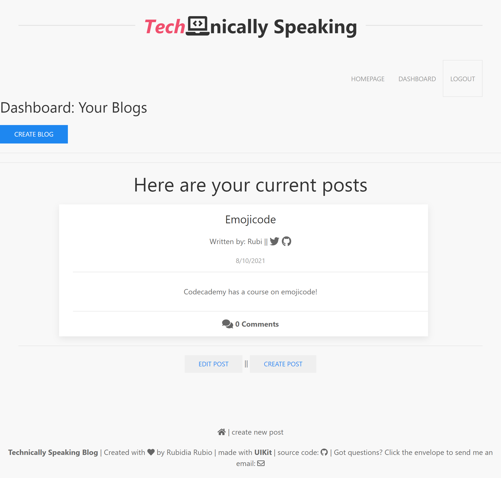

<div align="center">

# Technically Speaking A Blog Application


Built with Express-Handlebars

URL of the Heroku deployed application: https://stark-wave-96695.herokuapp.com/

URL of the GitHub repository: https://github.com/rubiocode/Technically-Speaking

</div>

## Table of Contents 

* [Description](#description)
    * [User Story](#user-story)
    * [Acceptance Criteria](#acceptance-criteria)
* [View](#view)
* [Installation](#installation)
* [Usage](#usage)
* [Built With](#built-with)
* [Future Improvements](#future-improvements)
* [License](#license)

## Description

The _Techniccally Speaking_ blog implements the MVC paradigm structure and uses Handlebars.js as a template to render pages. In addition, the application uses Express-Session npm package to authenticate the user's email and password as well as Bcrypt package to hash passwords. This is a simple blog application where the user is prompted to log in or sigup and onced logged in the user is able to post, update, and delete blogs and comments. 

### User Story

```md
AS A developer who writes about tech
I WANT a CMS-style blog site
SO THAT I can publish articles, blog posts, and my thoughts and opinions
```

### Acceptance Criteria

- [x] Main landing page presents workable links and existing posts.
- [x] User is prompted to either login or signup
- [x] When the user signs-up, he/she is prompted to create an account: username, twitter handler, github handler, email, and password.
- [x] When user signs-up credentials are then saved and user is logged in the site. 
- [x] The new user is able to re-login by using email and password.
- [x] Once user is logged in: 
- [x] The user sees workable dashboard link and the option to logout
- [x] The user is presented with a blog title, content, the blog creator's username, and date the post was created.
- [x] When the user opens up the dashboard he/she is presented with blogs the user has written if no post then it displays a message for the user.
- [x] In the dashboard, the user is able to create, update, and delete blogs.
- [x] When the user opens up a single blog he/she is able to create and post a comment under that blog.
- [x] The user is able to sign out of the site
- [x] ** NOT Achieved: delete/update comment 

## View

To view the Heroku deployed webpage click [here]().

This is what the application looks like:

Landing Page: 


Dashboard Page:



## Installation

Click [here](https://drive.google.com/file/d/1PgiB4x34a8a7TU_3KJq4PTr2H7CKBbWX/view) to see the full functionality of the application. 

To start using this _Technically Speaking_ blog application you must follow these instructions:

* Fork and clone this repository and save it to your computer. For help how to fork and clone click [here](https://guides.github.com/activities/forking/) 

* Download Postman to test the APIs. To download Postman click [here](https://www.postman.com/downloads/)

* Open your terminal and make sure noje.js is installed. To download node.js click [here](https://nodejs.org/en/download/)

* Run command _npm i_ to install all the dependencies in this repository. 


## Usage

In this _Technically Speaking_ application, the user can write, save, view, and delete blogs and comments.

If you are cloning this repository, run the following commands at the root of your project when prompted:

`mysql -u root -p`

Enter password when prompted

`source ./db/schema.sql`

`quit`

`npm run seed`

`npm start`


## Built With

* [Express](https://expressjs.com/) - A Node.js web application server framework used to build web applications.

* [express-handlebars](https://www.npmjs.com/package/express-handlebars) - An npm package to implement Handlebars.js for your Views

* [JavaScript ES6](https://www.w3schools.com/Js/js_es6.asp) - Programming language that creates dynamic website content. ES6 or ECMAScript 6 was the second major revision to JavaScript.

* [Node.js](https://nodejs.dev/learn/) - Node.js is an open-source, low-level, back-end JavaScript runtime platform that uses asynchronous programming and is a popular tool for almost any kind of project!.

* [Sequelize](https://www.npmjs.com/package/sequelize) - Sequelize is a promise-based Node.js ORM for Postgres, MySQL, MariaDB, SQLite and Microsoft SQL Server. 

* [dotenv package](https://nodejs.dev/learn/) - A package to store enviromental variables.

* [bcrypt package](https://www.npmjs.com/package/bcrypt) - An npm package that hash passwords.

* [express-session](https://www.npmjs.com/package/express-session) - A package that stores the session data on the client in a cookie.

* [connect-session-sequelize](https://www.npmjs.com/package/connect-session-sequelize) -

* [UIKit](https://getuikit.com/) - A lightweight and modular front-end framework for developing fast and powerful web interfaces.

* [connect-session-sequelize](https://www.npmjs.com/package/connect-session-sequelize) - 

* [MYSQL2](https://www.npmjs.com/package/mysql2) - MySQL2 project is a continuation of MySQL-Native. Protocol parser code was rewritten from scratch and api changed to match popular mysqljs/mysql.

## Future Improvements

Future improvements to this code: 

* Login and signup function do not render redirect automatically. The user successfully being logged or signed up but the page is not rendering the changes. Temporary fix: refresh the page and you will be routed to the dashboard/homepage page. ----> After deploying in Heroku app the login function is rendering bad request. User can still go through the sign up option. 

* Delete and edit comment functions not working properly. There are no handlebars for them and due to time, unable to keep working on them. Future fix: add an edit- comment handlebar that renders in the dashboard for user to modify or delete his/her own comments. 


## License


Copyright 2021 Rubidia Rubio. Licensed under the [MIT License](https://opensource.org/licenses/MIT)

All Rights Reserved. Permission is hereby granted, free of charge, to any person obtaining a copy of this software and associated documentation files (the "Software"), to deal in the Software without restriction, including without limitation the rights to use, copy, modify, merge, publish, distribute, sublicense, and/or sell copies of the Software, and to permit persons to whom the Software is furnished to do so, subject to the following conditions:

The above copyright notice and this permission notice shall be included in all copies or substantial portions of the
Software.

THE SOFTWARE IS PROVIDED "AS IS", WITHOUT WARRANTY OF ANY KIND, EXPRESS OR IMPLIED, INCLUDING BUT NOT LIMITED TO THE
WARRANTIES OF MERCHANTABILITY, FITNESS FOR A PARTICULAR PURPOSE AND NONINFRINGEMENT. IN NO EVENT SHALL THE AUTHORS OR
COPYRIGHT HOLDERS BE LIABLE FOR ANY CLAIM, DAMAGES OR OTHER LIABILITY, WHETHER IN AN ACTION OF CONTRACT, TORT OR
OTHERWISE, ARISING FROM, OUT OF OR IN CONNECTION WITH THE SOFTWARE OR THE USE OR OTHER DEALINGS IN THE SOFTWARE.
